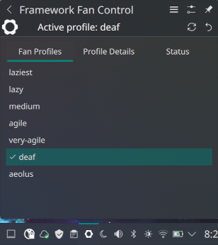
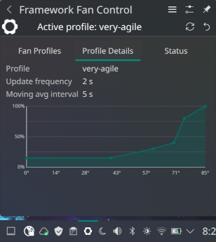

# Framework Fan Control — KDE Plasma 6 System Tray Widget

A KDE Plasma 6 system tray widget that reads and sets the fan profile of a
**Framework 16** laptop using the [`fw-fanctrl`](https://github.com/TamtamHero/fw-fanctrl)
command-line tool.

---

## Features

- **Tray icon** shows the Framework logo in the system tray. Hovering shows the active profile name in the tooltip.
- **Popup panel** has three tabs:
  - **Fan Profiles** — lists all available profiles with a checkmark next to the active one. Click any profile to apply it; the popup can be configured to close automatically.
  - **Profile Details** — shows the active profile's fan speed update frequency, moving average interval, and an interactive speed curve chart.
  - **Status** — shows live fan speed, temperature, moving average temperature, effective temperature, service active state, and whether the current profile is the default.
- **Popup header** shows the currently active profile name and provides a refresh button and a reset-to-default button.
- **Right-click context menu** provides *Refresh*, *Reload Configuration*, *Pause Service*, and *Resume Service* actions.
- **Auto-refresh** — polls `fw-fanctrl --output-format JSON print` at a configurable interval (default 3 seconds) so the tooltip and Status tab stay current even if the profile is changed externally.
- **Configurable options** — polling interval (1–10 seconds) and whether the popup closes automatically after selecting a profile.
- **Icon color** — the tray icon turns red on error and amber when the service is paused.
- Error messages are shown inline so you can tell immediately if `fw-fanctrl` is missing or returns an error.

---

## Screenshots





---

## Requirements

| Requirement | Notes |
|---|---|
| KDE Plasma 6 | Tested on Plasma 6.0+ |
| `plasma5support` | Required for the executable DataSource engine. Standard Plasma 6 dependency. |
| `qt6-5compat` | Required for icon color overlay (`Qt5Compat.GraphicalEffects`). Package name: `qt6-5compat` on Arch, `qt6-qt5compat` on Fedora. Usually already installed as a Plasma dependency. |
| `fw-fanctrl` | Must be in `$PATH`. Install from the [fw-fanctrl repo](https://github.com/TamtamHero/fw-fanctrl). |
| Framework 16 laptop | The widget works with any machine where `fw-fanctrl` is installed, but is designed for the Framework 16. |

---

## Installation

```bash
git clone https://github.com/augiedoggie/FrameworkFanPlasmoid   # or unzip the downloaded archive
cd FrameworkFanPlasmoid
chmod +x install.sh
./install.sh
```

The script copies the plasmoid to `~/.local/share/plasma/plasmoids/`, installs
the widget icon into the user icon theme, rebuilds the KDE service cache, and
attempts to restart Plasma Shell automatically.

### Manual installation

```bash
cp -r org.kde.fwfanctrl ~/.local/share/plasma/plasmoids/
# Install the icon:
mkdir -p ~/.local/share/icons/hicolor/scalable/apps
cp org.kde.fwfanctrl/contents/icons/framework.svg ~/.local/share/icons/hicolor/scalable/apps/
kbuildsycoca6
# Then restart Plasma:
plasmashell --replace &
```

You can also install the plasmoid via `kpackagetool6`:

```bash
kpackagetool6 --type Plasma/Applet --install org.kde.fwfanctrl
```

---

## Adding the widget to the System Tray

1. Right-click the system tray area in your panel.
2. Choose **Configure System Tray…**
3. Open the **Entries** tab.
4. Enable **Framework Fan Control** in the list under *System Services*.
